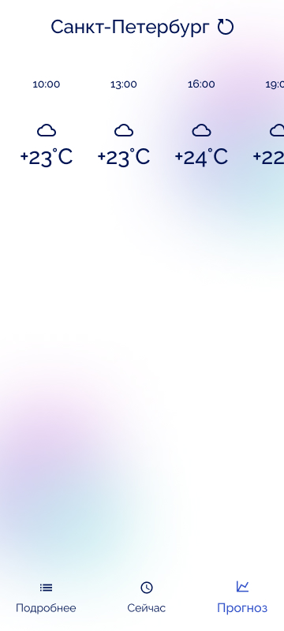

# OpenWeather App

This is a simple Android weather app. Uses data from the [OpenWeather API][weather-api].

## Screenshots

    

## Features

The application consists of three screens: current weather, current weather details, weather forecast.
- __Now__ screen displays basic information about the current weather: temperature, humidity, wind speed, pressure, sunrise and sunset.
- __Details__ screen gives you more details about the current weather, such as temperature, precipitation, and wind.
- __Forecast__ screen displays the weather forecast for 5 days every three hours, and when you click on the forecast card, you can see a more detailed forecast.

## Architecture

The Clean Architecture and UDF were used to create the application. So there are three layers: data, domain, ui.
- __Domain__ layer contains the application data model and the repository interfaces for accessing the data.
- __Data__ layer contains objects that come from the server, as well as implementations of the domain layer repositories.
- __UI__ layer contains the user interface as well as components for communicating with the domain layer.
UI components are associated with the [ViewModel][viewmodel], which are associated with repositories to receive data.
ViewModel classes have state (eg Init, Loaded, Error) and data (eg current weather).
The UI collects data and state via [StateFlow][stateflow] and renders as needed.
If some event is received from the user, for example, updating data, then this event is sent to the ViewModel instance, after which the state and data are updated, if necessary.

[Retrofit][retrofit] library is used to load data. To create a user interface - [Jetpack Compose][compose]. For dependency injection - [Hilt][hilt].

 [compose]: https://developer.android.com/jetpack/compose
 [weather-api]: https://openweathermap.org/api
 [viewmodel]: https://developer.android.com/topic/libraries/architecture/viewmodel
 [stateflow]: https://kotlin.github.io/kotlinx.coroutines/kotlinx-coroutines-core/kotlinx.coroutines.flow/-state-flow/
 [retrofit]: https://square.github.io/retrofit/
 [hilt]: https://dagger.dev/hilt/
